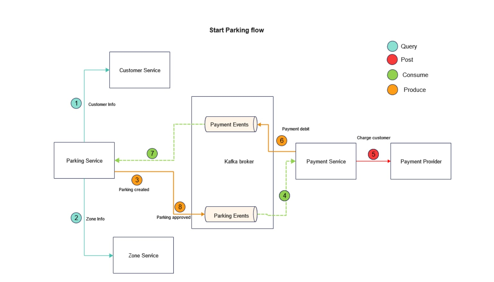
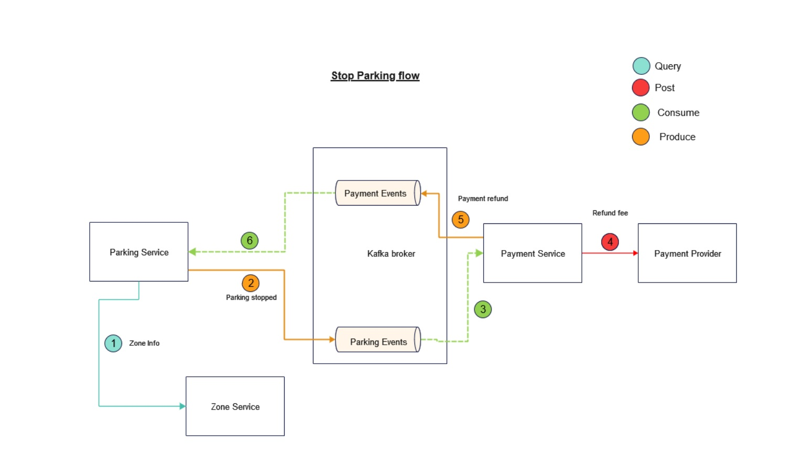

# Parking system application
This project was created as a practice project after finishing this course on Udemy: https://www.udemy.com/course/microservices-clean-architecture-ddd-saga-outbox-kafka-kubernetes
The business logic I have created here is very simple: The customer starts the parking and gets charged for remainder time of the day. When the parking is stopped, if some time was not utilized, because it was stopped earlier, then the correct amount (according to the not utilized time frame) is refunded.
The main focus was on the concepts discussed in the course.

## About the project:
**Concepts/technologies that are utilized**: 
- DDD
- Hexagonal architecture
- Outbox pattern
- Kafka messaging
- Choreography saga based on only domain events

**Services**:
- Parking
- Payment
- Zone
- Customer

**Project structure**: 
Hexagonal architecture.
Microservice modules consists of (only the two main service for now: Parking and Payment follows this structure, the rest are simplified):
1. Container module
2. Domain module
    - Application Service module
    - Domain Core module
3. Infrastructure/Adapter module(s) (messaging, dataaccess, external http client etc.)

Domain core module:
The domain core contains the entities, value objects and a domain service.

Application service module: 
Defines the input/output ports and implements the input ports.

Infrastructure:
Output port implementing "plugin" modules as well as input infra modules which delegate to input ports (e.g.: Rest Controller ). 

Container module:
This module glues together all the other modules into a working application. Bootstraps the app.

**The entry point is the Parking service API**:
- Start parking: POST /parkings
- Stop parking:  POST /parkings/{parkingId}/stop
- Track parking: GET  /parkings/{parkingId}/track

[](https://app.getpostman.com/run-collection/5457702-82280204-2ece-40bf-950d-58ff0b4edeaf?action=collection%2Ffork&source=rip_markdown&collection-url=entityId%3D5457702-82280204-2ece-40bf-950d-58ff0b4edeaf%26entityType%3Dcollection%26workspaceId%3D90db576c-cc7d-41d5-aae2-f027387a7cb8#?env%5BLocal%5D=W3sia2V5IjoidmFyLnRyYWNraW5nLmlkIiwidmFsdWUiOiIiLCJlbmFibGVkIjp0cnVlLCJ0eXBlIjoiYW55In0seyJrZXkiOiJ2YXIucGFya2luZy5pZCIsInZhbHVlIjoiIiwiZW5hYmxlZCI6dHJ1ZSwidHlwZSI6ImFueSJ9LHsia2V5IjoidmFyLmJhc2UudXJsIiwidmFsdWUiOiJodHRwOi8vbG9jYWxob3N0OjgxODEiLCJlbmFibGVkIjp0cnVlLCJ0eXBlIjoiZGVmYXVsdCJ9XQ==)

<p float="left">
  
  
</p>

## Run the application locally:
Two options: 
- **K8S** : Run the app in your local k8s cluster after generating the docker images by running mvn install from the root folder, then follow the steps at: https://github.com/mrkhlo/parking-system-infrastructure
- **IntelliJ** + **Docker**: Run the app with IntelliJ and Docker as detailed below

**Prerequisites**:
- Docker
- Maven
- Java 17
- Postgres DB running locally
- IntelliJ

**Steps**:
1. **Run Kafka Cluster, Zookeeper, Schema Registry and create the topics**:
     ```bash
      docker-compose -f common.yml -f zookeeper.yml up
     ```
     Wait for zookeeper to properly start up.
  
    ```bash
      docker-compose -f common.yml -f kafka_cluster.yml up
    ```
    Wait for the cluster to properly start up.

   ```bash
    docker-compose -f common.yml -f init_kafka.yml up
   ```
2. **Run all 4 service from IntelliJ**:
      Run ParkingServiceApplication, PaymentServiceApplication, ZoneServiceApplication, CustomerServiceApplication
